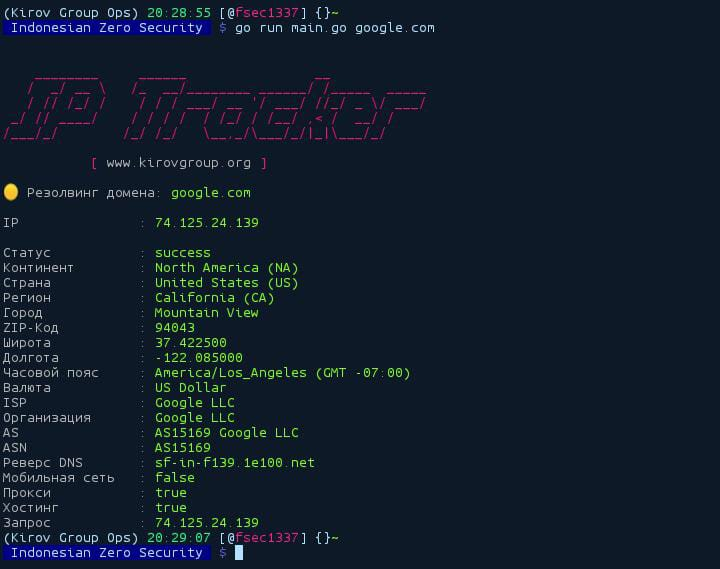

# IP TRACKER

**A lightweight, high performance IP/DNS geolocation utility written in Go.**  

---

## 📝 Description  
This tool fetches detailed geolocation and network information for a given IP address or domain by querying multiple APIs (IP-API, IPWhois, IPinfo). It provides structured output with color-coded formatting for better readability.  

### Key Features:  
- **Multi-Source Data Aggregation** – Combines results from `ip-api.com`, `ipwhois.app`, and `ipinfo.io`.  
- **Domain Resolution** – Automatically resolves domains to their IP addresses.  
- **Rich Metadata** – Retrieves:  
  - Geolocation (country, city, coordinates)  
  - Network details (ISP, ASN, hosting/proxy detection)  
  - Timezone and currency data  
- **User-Friendly Output** – Color-coded terminal output for clarity.  

---

## 🛠 Installation  
### Prerequisites  
- **Go 1.19+** ([Download](https://go.dev/dl/))  

### Steps  
1. Clone the repository:  
   ```bash  
   git clone https://github.com/FreedomSec1337/IP-Tracker
   cd ip-geolookup  
   ```  
2. Build the binary:  
   ```bash  
   go build -o ipt main.go  
   ```  
3. install module:
   ````bash
   go mod tidy 
   ````
4. Run directly (or move to `/usr/local/bin` for global access):  
   ```bash  
   ./ipt <IP_OR_DOMAIN>  
   ```  

---

## 🚀 Usage  
```bash  
./ipt 8.8.8.8                # Lookup by IP  
./ipt google.com             # Lookup by domain  
```  


## 🌐 API Coverage  
| Field               | Source          |  
|---------------------|-----------------|  
| Country/City        | IP-API          |  
| ASN/ISP             | IPWhois, IPinfo |  
| Proxy/Hosting       | IP-API          |  
| Timezone/Currency   | IPWhois         |  

---

## ⚠️ Limitations  
- **Rate Limits**: Free-tier APIs may impose request limits.  
- **Accuracy**: Geolocation data varies by provider.  
- **Dependencies**: Requires internet access to query APIs.  

---

## 📜 License  
MIT License. See [LICENSE](LICENSE) for details.  

---

## 📬 Contact  
- **Organization**: [Kirov Group](https://www.kirovgroup.org)  
- **Maintainer**: [@fsec1337](fsec@izsgroup.id)  

---